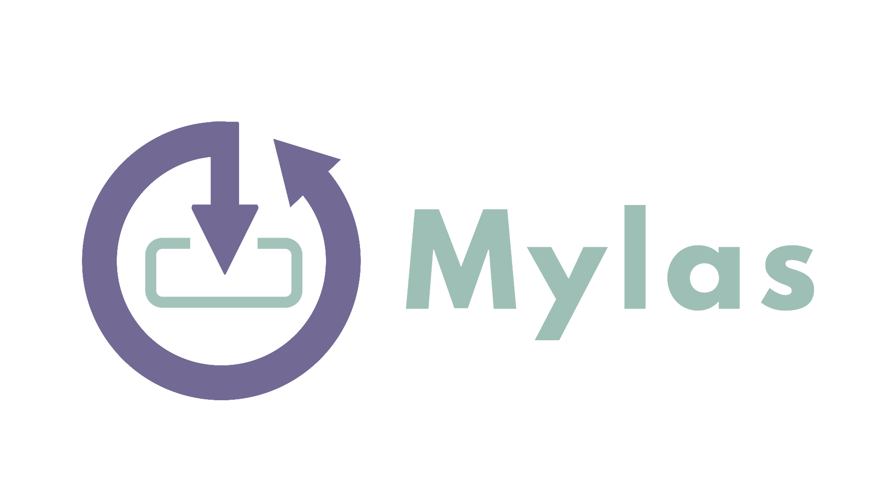

# Mylas 


   
Mylas is a npm package to make the loading and storing of data from fs easy and reliable. 
 

## Installation
Install Mylas from NPM
```
npm i mylas
```

## Examples
Save data/string to file
```
const Mylas = require("mylas");

const [path, data] = ["./text.txt", "Hello world!"];
Mylas.saveS(path, data); // saves sync
await Mylas.save(path, data[, callback]); // saves async
await Mylas.saveW(path, data[, callback]); // saves with worker

const loadedData = Mylas.loadS(path); //loads sync
const loadedData = await Mylas.load(path[, callback]); //loads async
const loadedData = await Mylas.loadW(path[, callback]); //loads with worker
```
Save JSON to file
```
const Mylas = require("mylas");

const JSONobject = {name: "test", data: "Hello world!"};
const [path, data] = ["./text.txt", JSONobject];
Mylas.json.saveS(path, data); // saves sync
await Mylas.json.save(path, data[, callback]); // saves async
await Mylas.json.saveW(path, data[, callback]); // saves with worker

const loadedJSON = Mylas.json.loadS(path); //loads sync
const loadedJSON = await Mylas.json.load(path[, callback]); //loads async
const loadedJSON = await Mylas.json.loadW(path[, callback]); //loads with worker
```

## Features
All features are listed at the [Features page](https://github.com/raouldeheer/Mylas/blob/main/.github/FEATURES.md).  

## Contributing
To start contributing read our [Contributing page](https://github.com/raouldeheer/Mylas/blob/main/.github/CONTRIBUTING.md).  

## Supported Versions
Check for supported versions at the [security policy](https://github.com/raouldeheer/Mylas/security/policy).  
